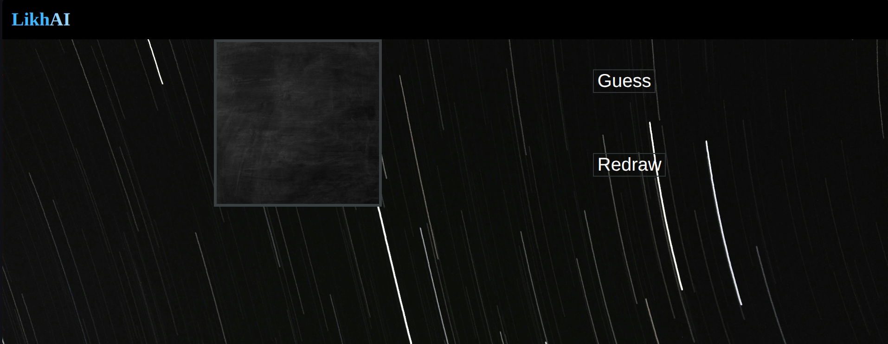
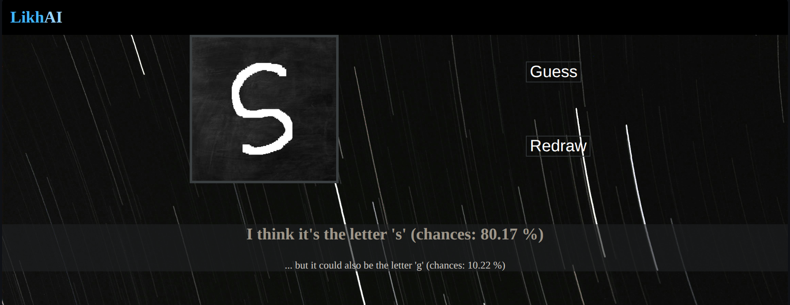
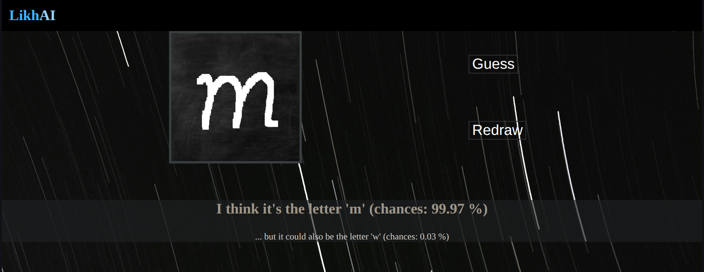

# LikhAI

LikhAI is a web application that recognizes **handwritten lowercase English letters** using a TensorFlow model trained from scratch. Users can draw a character directly on an HTML5 canvas, and the model predicts the most likely letter along with its confidence score.

The project was built to understand the complete machine learning pipeline—from dataset preparation and model training to deploying an interactive web application.

---

## Features

- Draw letters directly on an HTML5 Canvas.
- Real-time prediction using a trained TensorFlow model.
- Displays the most probable prediction along with confidence.
- Shows the second-best prediction for comparison.
- Simple Flask backend with asynchronous AJAX communication.

---

## How it works

```
User draws a letter
        │
        ▼
HTML5 Canvas (280×280)
        │
        ▼
JavaScript captures the image
        │
        ▼
Image resized to 28×28
        │
        ▼
Pixels converted into a matrix
        │
        ▼
Flattened into a feature vector
        │
        ▼
AJAX Request
        │
        ▼
Flask Backend
        │
        ▼
TensorFlow Model
        │
        ▼
Prediction + Confidence
```

---

## Tech Stack

- Python
- TensorFlow
- Flask
- HTML
- CSS
- Vanilla JavaScript
- AJAX

---

## Project Structure

```
.
├── app.py
├── requirements.txt
├── templates/
├── static/
├── model/
└── README.md
```

---

## Installation

Clone the repository

```bash
git clone <repository-url>
cd LikhAI
```

Install the required packages

```bash
pip install -r requirements.txt
```

Run the application

```bash
python app.py
```

Open your browser and visit

```
http://127.0.0.1:5000
```

---

## Screenshots

### Main Interface



### Prediction Example



### Another Example



---

## Current Limitations

This project is still a work in progress.

Currently, the input drawn on the **280×280 canvas** is resized to **28×28** before being passed to the model. This preprocessing step can sometimes distort handwritten strokes and reduce prediction accuracy.

Improving the preprocessing pipeline (centering, normalization, better scaling, etc.) is something I plan to work on in future updates.


---

## Future Improvements

- Better image preprocessing pipeline
- Improved scaling while preserving stroke information
- Display Top-3 predictions
- Better UI and responsiveness
- Support for uppercase letters and digits
- Deploy online

---

